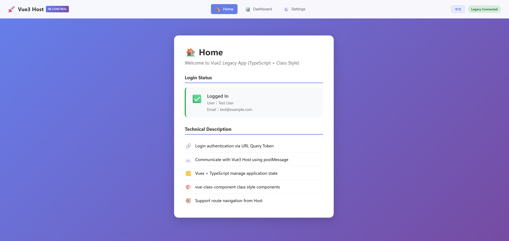

# Vue Hybrid Bridge Demo <span style="float: right;">[English](./README.en.md) | [中文版](./README.zh.md)</span>

本專案為技術展示用，目標是在**既有登入流程不可變更**的前提下，
以 Vue3 Host + iframe 方式整合 Vue2 Legacy，並透過 Message Bridge
同步狀態與導航，保留 URL token 登入機制。

---

## 截圖預覽



**功能展示：**
- 上方白色導航列為 **Vue3 Host** 控制（顯示「Vue3 Host 控制中」標籤）
- 導航按鈕（首頁、儀表板、設定）由 Vue3 控制 Vue2 路由
- 右上角顯示語言切換按鈕（中文/EN）和 Legacy 連接狀態
- 下方紫色區域為 **Vue2 Legacy** iframe 內容
- Vue2 在 iframe 模式下自動隱藏原生導航列
- 登入狀態透過 URL token 傳遞，由 Vue2 驗證後回報給 Vue3
- **中英文切換**：預設英文，點擊右上角語言按鈕（顯示「中文」）可切換至中文，Vue3 與 Vue2 語言同步

---

## 快速啟動（Quick Start）

### 環境需求

- Node.js >= 16.0.0（建議使用 18.x）
- npm >= 8.0.0

### 安裝與啟動

```bash
# 1. 安裝依賴
npm install

# 2. 建構 shared-bridge
npm run build:bridge

# 3. 同時啟動 Vue3 Host 與 Vue2 Legacy
npm run dev
```

### 開發伺服器

| 應用程式 | 網址 | 技術棧 |
|---------|------|--------|
| Vue3 Host | http://localhost:5173 | Vite + Vue3 + Pinia + TypeScript |
| Vue2 Legacy | http://localhost:8080 | Webpack + Vue2 + Vuex + TypeScript + Class Style |

---

## 專案結構

```
vue-hybrid-bridge-demo/
├── package.json                    # npm workspace 根設定
├── README.md                       # 本文件（入口點）
├── README.en.md                    # 英文版
├── README.zh.md                    # 中文版
├── AGENTS.md                       # AI 協作約束規則
│
├── docs/
│   ├── ARCHITECTURE.md             # 架構設計文件
│   ├── ARCHITECTURE.en.md          # 英文版
│   ├── ARCHITECTURE.zh.md          # 中文版
│   ├── LOGIN_FLOW.md               # 登入流程說明
│   ├── LOGIN_FLOW.en.md            # 英文版
│   ├── LOGIN_FLOW.zh.md            # 中文版
│   ├── INTEGRATION_GUIDE.md        # 整合指南
│   ├── INTEGRATION_GUIDE.en.md     # 英文版
│   ├── INTEGRATION_GUIDE.zh.md     # 中文版
│   └── images/
│       └── demo-screenshot.png
│
└── packages/
    ├── shared-bridge/              # 通訊協議層
    │   ├── src/
    │   │   ├── protocol.ts         # BridgeMessage 型別
    │   │   ├── host.ts             # HostBridge（Vue3 用）
    │   │   └── guest.ts            # GuestBridge（Vue2 用）
    │   └── README.md               # Bridge API 文件
    │
    ├── vue3-host/                  # Vue3 Shell
    │   └── src/
    │       ├── App.vue
    │       ├── stores/auth.ts      # Pinia store
    │       ├── composables/useBridge.ts
    │       └── components/
    │           └── LegacyFrame.vue # iframe 容器 + 導航
    │
    └── vue2-legacy/                # Vue2 Feature App
        └── src/
            ├── main.ts             # 入口（TypeScript）
            ├── App.vue             # Class Style 組件
            ├── store/index.ts      # Vuex + TypeScript
            ├── router/index.ts
            └── views/              # 頁面組件（Class Style）
```

---

## 核心功能

### ✅ 已實作

| 功能 | 說明 |
|------|------|
| URL Token 登入 | Vue2 從 URL query 解析 token，維持原有流程 |
| Bridge 通訊 | postMessage 雙向通訊 |
| 狀態同步 | Vue2 登入後透過 AUTH_READY 通知 Vue3 |
| 路由導航 | Vue3 可控制 Vue2 的路由 |
| 路由狀態回報 | Vue2 路由變化時通知 Vue3 |
| iframe 模式偵測 | Vue2 在 iframe 中自動隱藏導航列 |
| TypeScript 支援 | 兩端皆使用 TypeScript |
| 類別風格組件 | Vue2 使用 vue-class-component |
| **中英文切換** | **預設英文，支援切換至中文，Vue3/Vue2 語言同步** |

---

## 核心約束（Hard Constraints）

### 不可變更

- ✅ Vue2 登入流程維持：**URL query token**
- ✅ Vue2 仍負責「是否已登入」的最終判定
- ❌ 不可移除 URL token
- ❌ 不可要求 Vue2 改為純 message 登入

### 可新增

- ✅ Vue3 可產生 token 並帶入 iframe URL
- ✅ Vue3 / Vue2 可透過 bridge 同步登入狀態
- ✅ Vue2 可在登入完成後回報 AUTH_READY

---

## 可用指令

| 指令 | 說明 |
|------|------|
| `npm install` | 安裝所有依賴 |
| `npm run dev` | 同時啟動 Vue3 + Vue2 |
| `npm run dev:vue3` | 僅啟動 Vue3 Host |
| `npm run dev:vue2` | 僅啟動 Vue2 Legacy |
| `npm run build` | 建構所有專案 |
| `npm run build:bridge` | 建構 shared-bridge |

---

## 技術文件

- [架構設計文件](./docs/ARCHITECTURE.zh.md) | [English](./docs/ARCHITECTURE.en.md)
- [登入流程說明](./docs/LOGIN_FLOW.zh.md) | [English](./docs/LOGIN_FLOW.en.md)
- [整合指南](./docs/INTEGRATION_GUIDE.zh.md) | [English](./docs/INTEGRATION_GUIDE.en.md)
- [Bridge API 文件](./packages/shared-bridge/README.md)

> **注意：** 所有技術文件預設為英文版本。點擊文件開頭或結尾的語言連結可切換至中文版。

---

## 技術關鍵字

- iframe-based Legacy Integration
- URL Token Compatibility Layer
- Message Bridge (postMessage)
- Progressive Migration
- Strangler Fig Pattern
- TypeScript + Class Style Components

---

---

**Language:** [English](./README.en.md) | [中文版](./README.zh.md)

