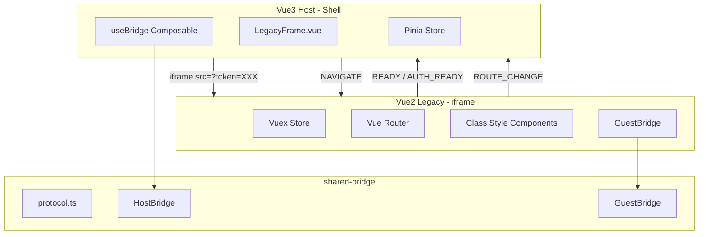
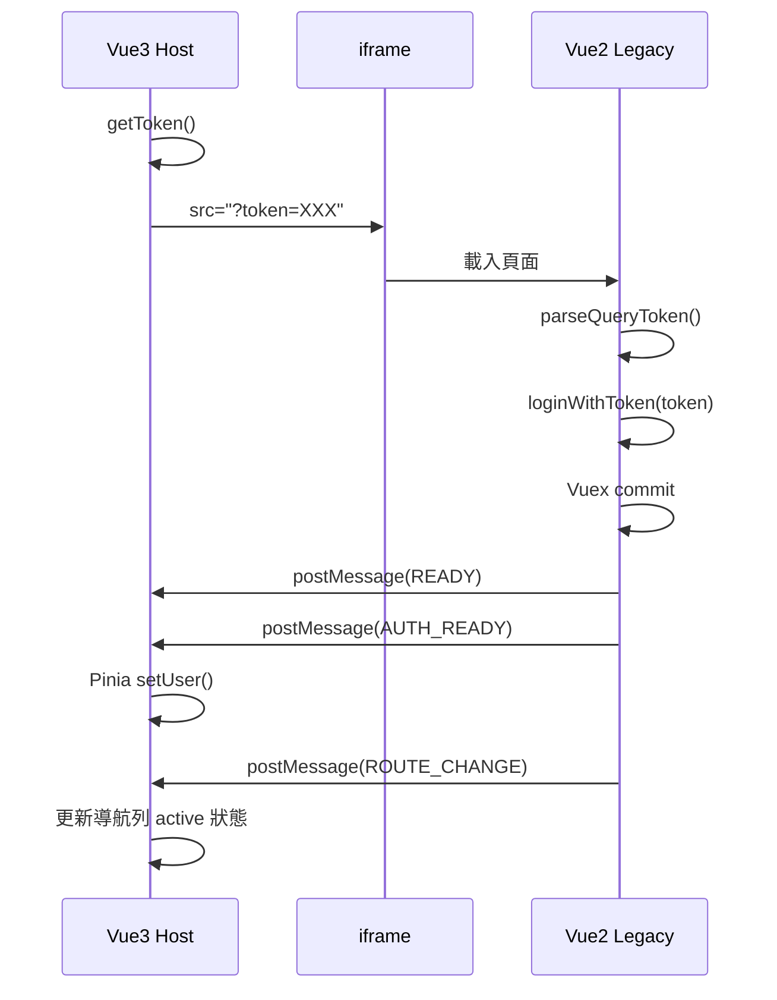
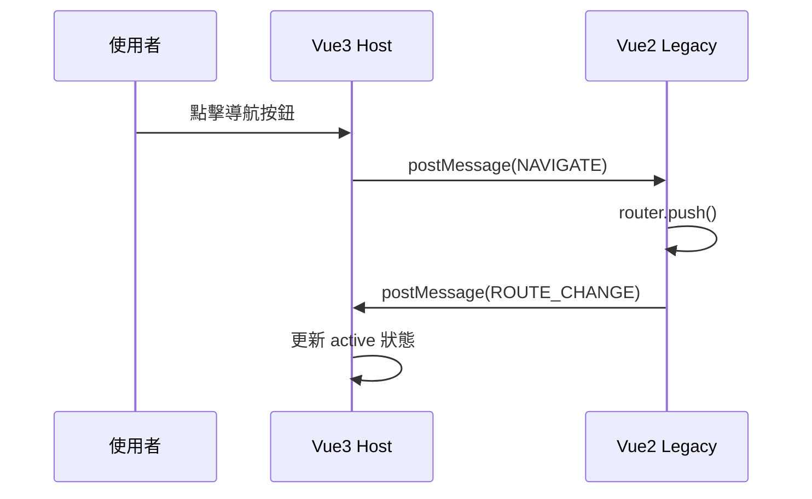

# 架構設計文件

## 系統架構概覽



---

## 元件職責說明

### Vue3 Host（Shell）

| 元件 | 檔案 | 職責 |
|------|------|------|
| App | `App.vue` | 根容器，僅包含 LegacyFrame |
| LegacyFrame | `LegacyFrame.vue` | iframe 容器、導航列、路由狀態顯示 |
| useBridge | `composables/useBridge.ts` | Bridge 連接與事件處理 |
| auth store | `stores/auth.ts` | 認證狀態、Legacy 路由狀態 |

### Vue2 Legacy（Feature App）

| 元件 | 檔案 | 職責 |
|------|------|------|
| main | `main.ts` | 入口、Bridge 初始化、登入流程 |
| App | `App.vue` | 根容器、導航列（非 iframe 模式） |
| store | `store/index.ts` | Vuex auth module |
| router | `router/index.ts` | 路由設定 |
| Views | `views/*.vue` | 類別風格頁面組件 |

### shared-bridge

| 模組 | 檔案 | 職責 |
|------|------|------|
| protocol | `protocol.ts` | BridgeMessage 型別、驗證函式 |
| HostBridge | `host.ts` | Vue3 端 Bridge 類別 |
| GuestBridge | `guest.ts` | Vue2 端 Bridge 類別 |

---

## 資料流向

### 啟動流程



### 導航流程



---

## 技術選型

### Vue3 Host

| 技術 | 版本 | 用途 |
|------|------|------|
| Vue | 3.4.x | 前端框架 |
| Vite | 5.x | 建構工具 |
| Pinia | 2.x | 狀態管理 |
| TypeScript | 5.x | 型別系統 |

### Vue2 Legacy

| 技術 | 版本 | 用途 |
|------|------|------|
| Vue | 2.6.x | 前端框架 |
| Vue CLI | 5.x | 建構工具 |
| Vuex | 3.x | 狀態管理 |
| vue-class-component | 7.x | 類別風格組件 |
| vue-property-decorator | 9.x | 裝飾器支援 |
| vuex-class | 0.3.x | Vuex 裝飾器 |
| TypeScript | 4.5.x | 型別系統 |

---

## 設計決策

### 1. 為何使用 iframe 隔離？

- Vue2 與 Vue3 執行環境完全獨立
- 避免 CSS / JS 衝突
- 可使用不同 Node 版本開發
- 符合 Strangler Fig Pattern

### 2. 為何保留 URL Token？

- 維持既有登入流程
- Vue2 端無需修改核心邏輯
- 單一真實來源（Vue2）
- 降低整合風險

### 3. Bridge 的角色

- **不是**登入的主要手段
- **是**狀態回報與事件傳遞的通道
- 輕量級、無狀態、雙向通訊

### 4. 為何使用類別風格組件？

- 與既有 Vue2 專案風格一致
- 更好的 TypeScript 支援
- 裝飾器語法更直觀

---

## iframe 模式偵測

Vue2 可偵測自己是否在 iframe 中運行：

```typescript
get isInIframe(): boolean {
  try {
    return window.self !== window.top
  } catch (e) {
    return true // 跨域時無法存取 window.top
  }
}
```

用途：
- iframe 模式：隱藏導航列，由 Vue3 Host 控制
- 獨立模式：顯示完整導航列

---

## 安全性考量

### postMessage Origin

生產環境建議指定明確的 origin：

```typescript
// Vue3 Host
const bridge = new HostBridge({
  targetOrigin: 'https://legacy.example.com'
})

// Vue2 Legacy
const bridge = new GuestBridge({
  targetOrigin: 'https://host.example.com'
})
```

### Token 傳遞

- Token 透過 URL query 傳遞（符合既有流程）
- Vue2 負責驗證 token 有效性
- Bridge 不傳遞敏感憑證
