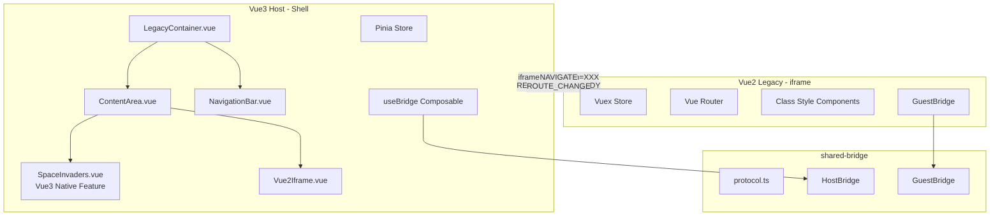
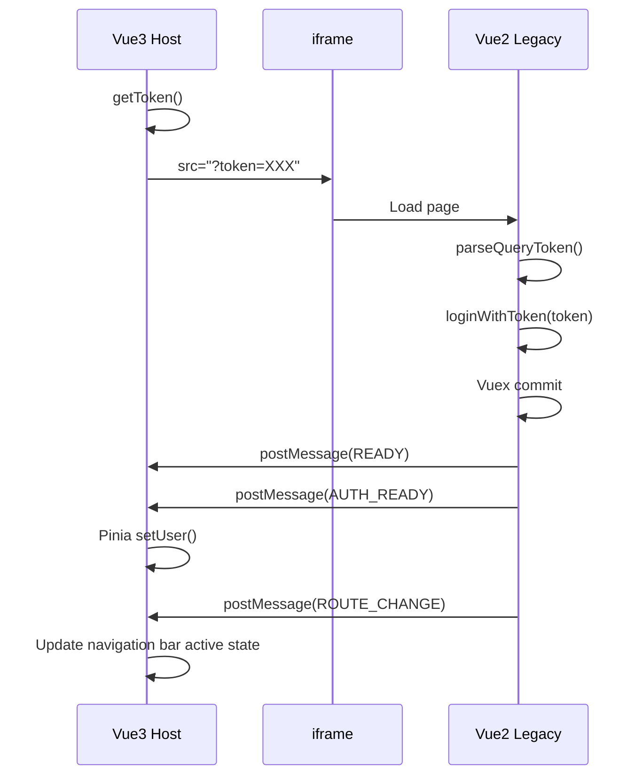
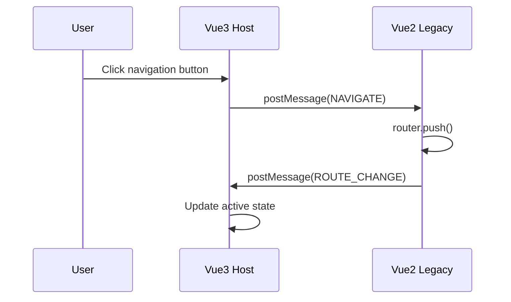

# Architecture Design Document

**Language:** [English](./ARCHITECTURE.en.md) | [中文版](./ARCHITECTURE.zh.md)

---

## System Architecture Overview



---

## Component Responsibilities

### Vue3 Host (Shell)

| Component | File | Responsibility |
|-----------|------|----------------|
| App | `App.vue` | Root container, router view |
| LegacyContainer | `components/LegacyContainer.vue` | Main container, manages view switching |
| NavigationBar | `components/NavigationBar.vue` | Navigation bar, route buttons, language toggle |
| ContentArea | `components/ContentArea.vue` | Content area, switches between Legacy iframe and Vue3 features |
| Vue2Iframe | `components/Vue2Iframe.vue` | iframe wrapper for Vue2 Legacy |
| SpaceInvaders | `components/SpaceInvaders.vue` | Vue3 native 3D game (Babylon.js), demonstrates Vue3 capabilities |
| useBridge | `composables/useBridge.ts` | Bridge connection and event handling |
| auth store | `stores/auth.ts` | Authentication state, Legacy route state |

### Vue2 Legacy (Feature App)

| Component | File | Responsibility |
|-----------|------|----------------|
| main | `main.ts` | Entry point, Bridge initialization, login flow |
| App | `App.vue` | Root container, navigation bar (non-iframe mode) |
| store | `store/index.ts` | Vuex auth module |
| router | `router/index.ts` | Route configuration |
| Views | `views/*.vue` | Class style page components |

### shared-bridge

| Module | File | Responsibility |
|--------|------|---------------|
| protocol | `protocol.ts` | BridgeMessage types, validation functions |
| HostBridge | `host.ts` | Vue3 side Bridge class |
| GuestBridge | `guest.ts` | Vue2 side Bridge class |

---

## Data Flow

### Startup Flow



### Navigation Flow



---

## Technology Stack

### Vue3 Host

| Technology | Version | Purpose |
|------------|---------|---------|
| Vue | 3.4.x | Frontend framework |
| Vite | 5.x | Build tool |
| Pinia | 2.x | State management |
| TypeScript | 5.x | Type system |
| Babylon.js | 8.x | 3D rendering engine (for Space Invaders) |
| vue-i18n | 9.x | Internationalization |

### Vue2 Legacy

| Technology | Version | Purpose |
|------------|---------|---------|
| Vue | 2.6.x | Frontend framework |
| Vue CLI | 5.x | Build tool |
| Vuex | 3.x | State management |
| vue-class-component | 7.x | Class style components |
| vue-property-decorator | 9.x | Decorator support |
| vuex-class | 0.3.x | Vuex decorators |
| TypeScript | 4.5.x | Type system |

---

## Design Decisions

### 1. Why Use iframe Isolation?

- Vue2 and Vue3 execution environments are completely independent
- Avoid CSS / JS conflicts
- Can use different Node versions for development
- Follows Strangler Fig Pattern

### 2. Why Keep URL Token?

- Maintain existing login flow
- Vue2 side doesn't need to modify core logic
- Single source of truth (Vue2)
- Reduces integration risk

### 3. Bridge's Role

- **Not** the primary means of login
- **Is** a channel for state reporting and event passing
- Lightweight, stateless, bidirectional communication

### 4. Why Use Class Style Components?

- Consistent with existing Vue2 project style
- Better TypeScript support
- More intuitive decorator syntax

### 5. Vue3 Native Features

Vue3 Host can host native Vue3 features alongside the Legacy iframe:

- **Space Invaders 3D Game**: Demonstrates Vue3's capability to run modern 3D applications
- **Independent Routing**: Vue3 features use Vue Router, separate from Vue2 routes
- **View Switching**: `ContentArea` component switches between Legacy iframe and Vue3 features
- **Responsive Design**: Full RWD support for desktop, tablet, and mobile
- **Virtual Controls**: Touch-friendly controls for mobile gaming

**Architecture Pattern:**
- Legacy routes: Controlled via Bridge, displayed in iframe
- Vue3 routes: Native Vue Router, displayed as Vue3 components
- Navigation: Unified navigation bar controls both types

---

## iframe Mode Detection

Vue2 can detect if it's running in an iframe:

```typescript
get isInIframe(): boolean {
  try {
    return window.self !== window.top
  } catch (e) {
    return true // Cannot access window.top when cross-origin
  }
}
```

Usage:
- iframe mode: Hide navigation bar, controlled by Vue3 Host
- Standalone mode: Show full navigation bar

---

## Security Considerations

### postMessage Origin

Production environment should specify explicit origin:

```typescript
// Vue3 Host
const bridge = new HostBridge({
  targetOrigin: 'https://legacy.example.com',
  allowedOrigins: ['https://legacy.example.com']
})

// Vue2 Legacy
const bridge = new GuestBridge({
  targetOrigin: 'https://host.example.com',
  allowedOrigins: ['https://host.example.com']
})
```

### Token Passing

- Token passed via URL query (follows existing flow)
- Vue2 responsible for validating token validity
- Bridge does not pass sensitive credentials

---

**Language:** [English](./ARCHITECTURE.en.md) | [中文版](./ARCHITECTURE.zh.md)
