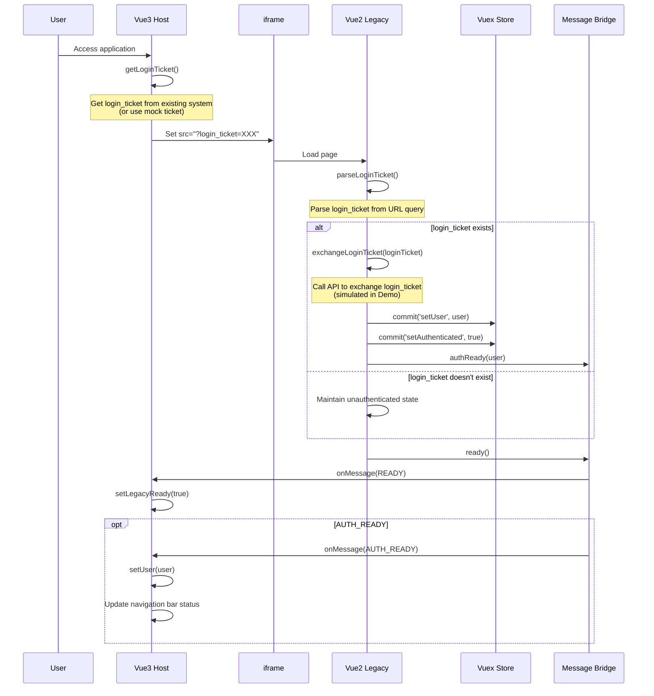

# Login Flow Documentation

**Language:** [English](./LOGIN_FLOW.en.md) | [中文版](./LOGIN_FLOW.zh.md)

---

## Core Principle

> **Vue2 login flow must maintain URL query login_ticket, cannot be changed.**

This is the most important constraint of this project. Any modifications must follow this principle.

---

## Flow Sequence Diagram



---

## Code Reference

### Step 1: Vue3 Get Login Ticket

```typescript
// packages/vue3-host/src/stores/auth.ts
function getLoginTicket(): string {
  // Demo purpose: use fixed mock login_ticket
  // In real application, get from existing system
  return 'demo-login-ticket-12345'
}
```

### Step 2: Vue3 Load iframe (URL with login_ticket)

```typescript
// packages/vue3-host/src/components/LegacyFrame.vue
const legacyUrl = computed(() => {
  const baseUrl = 'http://localhost:8080'
  const loginTicket = authStore.getLoginTicket()
  return `${baseUrl}/?login_ticket=${loginTicket}`
})
```

```vue
<template>
  <iframe :src="legacyUrl" @load="onIframeLoad" />
</template>
```

### Step 3: Vue2 Parse URL Login Ticket

```typescript
// packages/vue2-legacy/src/main.ts
function parseLoginTicket(): string | null {
  const urlParams = new URLSearchParams(window.location.search)
  return urlParams.get('login_ticket')
}
```

### Step 4: Vue2 Login and Report

```typescript
// packages/vue2-legacy/src/main.ts
const loginTicket = parseLoginTicket()

if (loginTicket) {
  const user = await exchangeLoginTicket(loginTicket)
  
  // Write to Vuex
  store.commit('auth/setUser', user)
  store.commit('auth/setAuthenticated', true)
  
  // Report via Bridge
  bridge.authReady(user)
}

// Notify ready (regardless of login status)
bridge.ready()
```

### Step 5: Vue3 Receive Messages

```typescript
// packages/vue3-host/src/composables/useBridge.ts
bridge.on('READY', () => {
  authStore.setLegacyReady(true)
})

bridge.on('AUTH_READY', (message) => {
  authStore.setUser(message.user)
})
```

---

## State Responsibility Division

| Item | Owner | Description |
|------|-------|-------------|
| Login Ticket Source | Vue3 or existing system | Generate and pass login_ticket |
| Login Ticket Exchange | Vue2 | Get from URL and exchange |
| Login Status Determination | Vue2 | Single source of truth (SSOT) |
| User Information | Vue2 → Vue3 | Sync via AUTH_READY |
| UI Navigation Status | Vue3 | Display purpose |
| Route Control | Vue3 → Vue2 | NAVIGATE message |

---

## Error Handling

### Login Ticket Doesn't Exist

```typescript
// packages/vue2-legacy/src/main.ts
const loginTicket = parseLoginTicket()

if (!loginTicket) {
  console.log('[Vue2] No login_ticket provided, staying as guest')
  // Maintain unauthenticated state, don't send AUTH_READY
  bridge.ready() // Still notify Vue3 that ready
}
```

### Login Failed

```typescript
try {
  const user = await exchangeLoginTicket(loginTicket)
  store.commit('auth/setUser', user)
  bridge.authReady(user)
} catch (error) {
  console.error('[Vue2] Login failed:', error)
  store.commit('auth/setAuthenticated', false)
  // Don't send AUTH_READY, Vue3 maintains unauthenticated state
}
```

---

## User Information Structure

```typescript
interface User {
  id: number
  name: string
  email: string
  apiToken?: string
  [key: string]: unknown  // Can extend other fields
}
```

---

## Acceptance Criteria

| Criteria | Status |
|----------|--------|
| Vue3 iframe URL correctly includes login_ticket | ✅ |
| Vue2 successfully logs in following original flow | ✅ |
| Vue3 receives notification after Vue2 login completes | ✅ |
| Vue3 navigation bar displays user information | ✅ |
| No login_ticket → Vue2 shows unauthenticated state | ✅ |
| Vue2 original login core logic not modified | ✅ |

---

## Checklist

Before modifying any login-related code, confirm:

- [ ] Is URL login_ticket flow maintained?
- [ ] Is Vue2 still responsible for login status determination?
- [ ] Is bridge only used for state reporting?
- [ ] Is Vue2 original login logic unmodified?
- [ ] Is error handling complete?

---

**Language:** [English](./LOGIN_FLOW.en.md) | [中文版](./LOGIN_FLOW.zh.md)
