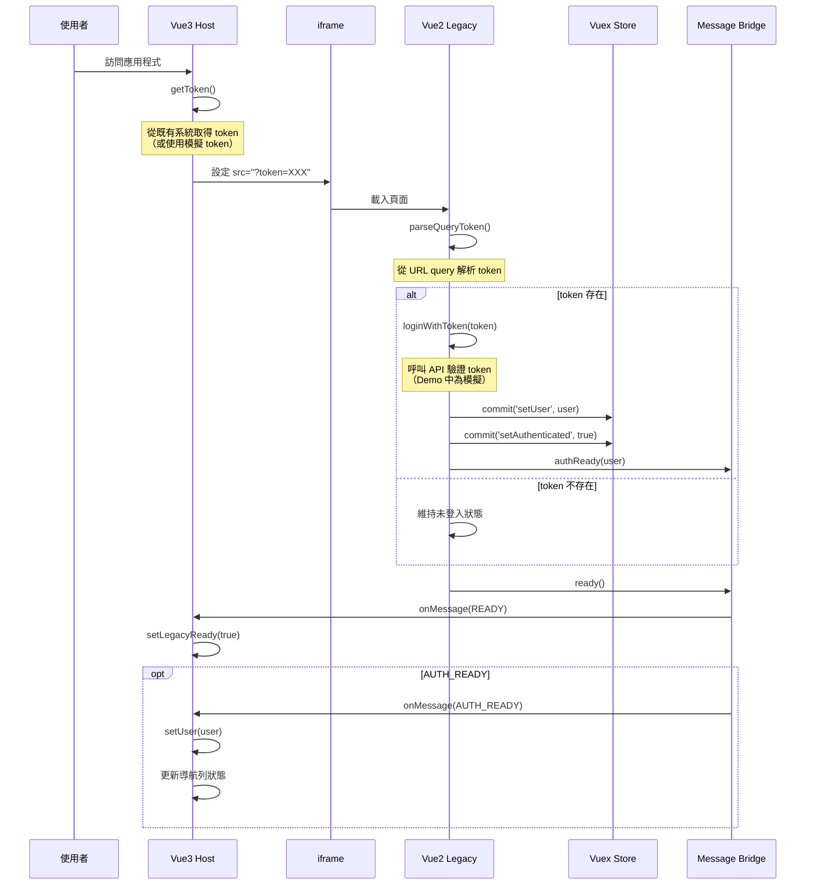

# 登入流程說明

**語言：** [English](./LOGIN_FLOW.en.md) | [中文版](./LOGIN_FLOW.zh.md)

---

## 核心原則

> **Vue2 登入流程必須維持 URL query token，不可變更。**

這是本專案最重要的約束條件。任何修改都必須遵守此原則。

---

## 流程時序圖



---

## 程式碼對照

### Step 1: Vue3 取得 Token

```typescript
// packages/vue3-host/src/stores/auth.ts
function getToken(): string {
  // Demo 用途：使用固定的模擬 token
  // 實際應用中應從既有系統取得
  return 'demo-token-12345'
}
```

### Step 2: Vue3 載入 iframe（URL 帶 token）

```typescript
// packages/vue3-host/src/components/LegacyFrame.vue
const legacyUrl = computed(() => {
  const baseUrl = 'http://localhost:8080'
  const token = authStore.getToken()
  return `${baseUrl}/?token=${token}`
})
```

```vue
<template>
  <iframe :src="legacyUrl" @load="onIframeLoad" />
</template>
```

### Step 3: Vue2 解析 URL Token

```typescript
// packages/vue2-legacy/src/main.ts
function parseQueryToken(): string | null {
  const urlParams = new URLSearchParams(window.location.search)
  return urlParams.get('token')
}
```

### Step 4: Vue2 登入並回報

```typescript
// packages/vue2-legacy/src/main.ts
const token = parseQueryToken()

if (token) {
  const user = await loginWithToken(token)
  
  // 寫入 Vuex
  store.commit('auth/setUser', user)
  store.commit('auth/setAuthenticated', true)
  
  // 透過 Bridge 回報
  bridge.authReady(user)
}

// 通知已準備就緒（無論是否登入）
bridge.ready()
```

### Step 5: Vue3 接收訊息

```typescript
// packages/vue3-host/src/composables/useBridge.ts
bridge.on('READY', () => {
  authStore.setLegacyReady(true)
})

bridge.on('AUTH_READY', (message) => {
  authStore.setUser(message.user)
})
```

---

## 狀態責任分工

| 項目 | 主責 | 說明 |
|------|------|------|
| Token 來源 | Vue3 或既有系統 | 產生並傳遞 token |
| Token 驗證 | Vue2 | 從 URL 取得並驗證 |
| 登入狀態判定 | Vue2 | 單一真實來源（SSOT） |
| 使用者資訊 | Vue2 → Vue3 | 透過 AUTH_READY 同步 |
| UI 導航狀態 | Vue3 | 顯示用途 |
| 路由控制 | Vue3 → Vue2 | NAVIGATE 訊息 |

---

## 錯誤處理

### Token 不存在

```typescript
// packages/vue2-legacy/src/main.ts
const token = parseQueryToken()

if (!token) {
  console.log('[Vue2] No token provided, staying as guest')
  // 維持未登入狀態，不發送 AUTH_READY
  bridge.ready() // 仍然通知 Vue3 已準備就緒
}
```

### 登入失敗

```typescript
try {
  const user = await loginWithToken(token)
  store.commit('auth/setUser', user)
  bridge.authReady(user)
} catch (error) {
  console.error('[Vue2] Login failed:', error)
  store.commit('auth/setAuthenticated', false)
  // 不發送 AUTH_READY，Vue3 維持未登入狀態
}
```

---

## 使用者資訊結構

```typescript
interface User {
  id: number
  name: string
  email: string
  token?: string
  [key: string]: unknown  // 可擴展其他欄位
}
```

---

## 驗收條件

| 條件 | 狀態 |
|------|------|
| Vue3 iframe URL 正確帶入 token | ✅ |
| Vue2 依原流程成功登入 | ✅ |
| Vue2 登入完成後 Vue3 收到通知 | ✅ |
| Vue3 導航列顯示使用者資訊 | ✅ |
| 未帶 token → Vue2 顯示未登入狀態 | ✅ |
| 未修改 Vue2 原登入核心邏輯 | ✅ |

---

## 檢核清單

在修改任何登入相關程式碼前，請確認：

- [ ] 是否維持 URL token 登入流程？
- [ ] 是否仍由 Vue2 判定登入狀態？
- [ ] 是否僅使用 bridge 作為狀態回報？
- [ ] Vue2 原有登入邏輯是否未被修改？
- [ ] 錯誤處理是否完善？

---

**語言：** [English](./LOGIN_FLOW.en.md) | [中文版](./LOGIN_FLOW.zh.md)
